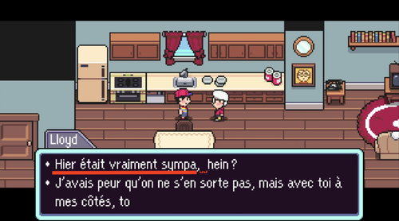
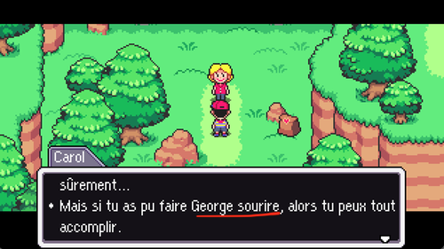
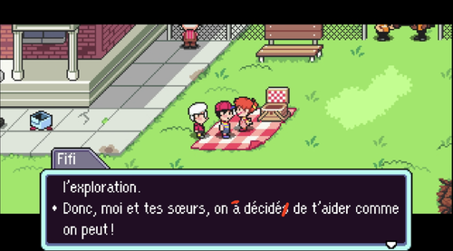
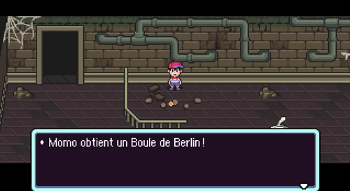
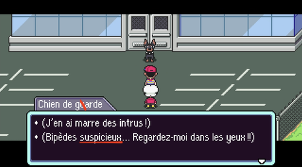
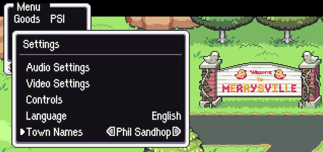
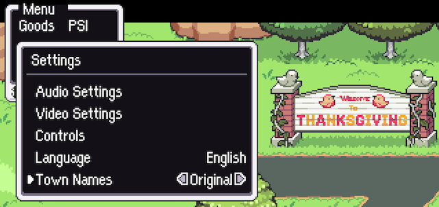

# MOTHER: Encore+
a.k.a. _MOTHER: Encore act 2 with an actually good French translation – and a few extras_

MOTHER: Encore+ is an improved version of MOTHER: Encore. It includes the following features:
* A full French retranslation, that fixes all the issues in the translation that was “officially” included in the game, while also being more faithful to the original Japanese text and more consistent with the other games in the series.
* An optional “alt” version of the English version, with the original town names (Mother’s Day, Thanksgiving, etc.), in both dialogue and graphics.
* Some quality of life improvements, such as a mappable button to show the HP/PP counter during gameplay.
* Other improvements and bug fixes.
* Actually open source from day one.
* Linux ARM64 version.
* A few surprises too!
* Coming soon: Japanese translation.

Based on the work of Team Encore. [Check out the inferior version](https://mother-encore.itch.io/mother-encore)

Team Encore (or actually anyone) is free to use any of my contributions or suggestions listed here. That team will not be doing this though, as they would feel too stupid doing it.

## Why redo the French translation?

Team Encore mentioned on their website that anyone can use the code to create their own mods, translations and fangames. So, that’s what I did it, after considering the game would certainly benefit from my work.

Because here’s the thing: if you speak even just a smattering of French, you’ll notice that the French translation for MOTHER: Encore Act 2 is a disaster. Grammar mistakes, mistranslated lines, unidiomatic phrasing, poor writing… The kind of mistakes that would make your middle school teacher to circle your exam paper in red all over the place.

These are not just the kind of little, remaining oversights that would appear due to a game being recently released: act 2 has been out for 2 months, and patch updates have since been released which were supposed to fix the translation… and yet, it’s still in that dreadful state.

Considering the professional quality the game claims to have, this translation stands out pretty badly. I felt that French-speaking fans deserved better…

### A few examples from their French translation

What kind of French speaker would approve such weird lines? 

&nbsp;

“If you were able to make _smile George_”, literally… 

&nbsp;

Two grammar mistakes out of 3 words… 

&nbsp;

The “Berliner” item uses wrong articles, in such a way that it becomes a “Berlin butt”… 

&nbsp;

“Suspicieux” doesn’t mean suspicious but suspecting. “Garde” is misspelt.\
Oh, and the English line doesn’t say “I’m tired of intruders”, so the meaning is lost, too.

And it goes on and on…

&nbsp;

### What I did
My focus was to make the translation feel professional. Players deserve to enjoy the game to the fullest, without being distracted by clumsy phrasing, mistakes or incomprehensible sentences.

I also consider it is important to keep consistency with the other games in the series. It is not a good thing when an item name is translated as “Fusée crayon” in one game and “Fusée bouteille” in another, for example.

Finally, my translation reverts some of the changes made by Phil Sandhop when he translated the original MOTHER from Japanese into English for the American market. They aren’t really relevant to a French-speaking audience of today, not to mention that this audience has no particular memories of Phil Sandhop’s text that would need to be preserved. The French translation provided by Team Encore also also attempted to do this, but in a very inconsistent manner; there are even instances where the name of the same object is translated in two different ways within the same game…

&nbsp;

## A new option for town names!
The original MOTHER games has two different translations: EarthBound Beginnings for the NES, translated by Phil Sandhop, and the MOTHER 1+2 fan translation, by Clyde Mandelin. The latter directly uses the original town names from the Japanese game: Mother’s Day, Thanksgiving, Valentine, etc., whereas the former changed those names to Podunk, Merrysville, Ellay, etc.

English-speaking fans are divided between those who prefer the original names and those who prefer Phil Sandhop’s names. But why have a choice forced upon you when you can simply pick between the two options in the game settings? If you play the game in English, now you can make that choice! It will be reflected in the game dialogue, menus and in-game graphics.

Would you call it Merrysville...

&nbsp;

... or Thanksgiving?

## Appendix: List of all issues I found in the French translation of MOTHER: Encore Act 2

Listed here for reference. I’m not mentionning all instances of clumsy wording and poor writing style, only issues that pretty much everyone can agree on.

Battlers
* “Son poison à été développé” ⇒ Grammar: à→a
* “Il à été dressé” ⇒ Grammar: à→a
* “L'engin à dû perdre les boulons ¦” ⇒ Grammar: à→a
* “L',l',Un ,un ,de l',à l',,le ,x” ⇒ Incorrect elision L’/l’ for MalÊtre Putride
* “Au rouge, il te tire dessus” ⇒ Informal “te” from the narrator, inconsistent with the rest of the game where it uses “vous” to address the player
* “Le ,le ,Un ,un ,du ,au ,,le ,x” ⇒ Wrong gender for Décharge
* “MalÊtre Putride”, “Linceullier”, “Appareil gélatineux”, “Fusée Bouteille” ⇒ translation changes that reduce consistency with Mother 1, Mother 3…
* “Il à des amis  ¦” ⇒ Grammar: à→a
* Capital letters at the start of every word, inadequate in French languaae ⇒ See Breath of the Wild for reference, “Soldier’s Greaves” vs. “Jambières de soldat” (or just any modern game)

Battlescenes
* [color][ui_select][/color] [if input:gamepad]button[else]key[/if] ⇒ Untranslated “key”, should be “bouton” instead of “touche”, [ui_select] should come after
* “Rassures moi” ⇒ Grammar, extra 's' + missing hyphen
* “Tu vois ta barre de PC” ⇒ Inconsistent, the translation for “SP” is “PT” for “Points de talent”, as the translation for “skill” is “talent” everywhere else, which is also consistent with Mother 3
* IL SEMBLE AVOIR UNE ERREUR DE CALCUL... ⇒ Missing “y” pronoun
* “Dis moi, tu m'as l'air bien rouillé” ⇒ Missing hyphen
* Ta mère t'as pas appris ⇒ Grammar as→a
* C'est la que t'peux faire un Encore ⇒ Grammar la→là
* Juste imagine moi ⇒ Calque for “Just imagine”, sounds clumsy in French + missing hyphen
* N-Non, rien ne va...\n J'ai besoin de plus de puissance de feu ¦ ⇒ Extra space after line break

Battleskills
* “une boule enflamée” ⇒ Wrong spelling →enflammée
* “une boule enflamée qui brûle à l'impact” ⇒ Pleonasm
* “{n0}{name} a appelé {n4} un sujet ¦” ⇒ {n4} is totally wrong here, it only made sense in English! Adds an unexpected preposition…
* “{name} à bricolé {t1}{target} ¦” ⇒ Grammar à→a
* “Tire un caillou qui à une chance de rebondir” ⇒ Grammar à→a
* “Court circuit” ⇒ Missing hyphen →Court-circuit
* “{n0}{name} a court circuité ¦” ⇒ Wrong verb, court-circuiter is a transitive verb and requires a direct object
* “{n0}{name} a tiré le Flingue Banane ¦” ⇒ Calque from English, wrong syntax in French as “tirer” isn’t transitive with that meaning; it would sound like the actor is pulling the gun towards themselves.

Items
* “Soigne l'empoisonnement ⇒ [Poisoned]”. ⇒ “soin” generally refers to HP restoration in the game, as opposed to “guérison” that refers to status ailments, for consistency, cf PSI skills “Soin ꞵ” and “Guérison ꞵ”
* “Si tu la découpe” ⇒ Grammar, missing s
* “Si tu la découpe” ⇒ Informal “tu” from the narrator, inconsistent with the rest of the game
* “pour toute l'équipe!” ⇒ Missing space before “!”
* “Favori des joueurs professionels” ⇒ Feminine gender expected for a “batte”, should be “Favorite”
* “des joueurs professionels” ⇒ Wrong spelling, missing n →professionnels
* “Il y a même sa signature!” ⇒ Missing space before “!”
* “Pour les jeunes stars de baseball prometteurs.” ⇒ Wrong gender →prometteuses
* “Gâteau piqûre d’abeille” ⇒ The correct French name for this cake is “gâteau nid d’abeille”
* “Restaure XX PV” ⇒ The word used everywhere else was “Rend”
* “Le ,le ,Un ,un ,ce ,,on,votre ,le ,de ,a” ⇒ Wrong gender for Boule de Berlin
* “Frit jusqu'à une perfection glacée” ⇒ Wrong gender for Boule de Berlin, should be “Frite”
* “Fusée Bouteille”, “Fusée crayon” ⇒ Inconsistent, two different translations for the same item
* “Fragile, mais fait avec du coeur.” ⇒ Should be “cœur”, with the “œ” letter
* “La Fusée Bouteille doit voler !” ⇒ Wrong translation for “needs this to fly”, the rocket doesn’t “need to fly” but it needs this component to fly
* “Fais vite et attache-la !” ⇒ Calque for “hurry and”
* “Cette Fusée Bouteille en à besoin pour se diriger !” ⇒ Grammar: à→a
* “Fais vite et attaches-les !” ⇒ Grammar -s
* “Peut être que [LLOYD] pourrait la réparer.” ⇒ “peut-être”, a hyphen is missing
* “Le ,le ,Un ,un ,ce ,,on,votre ,le ,de ,a” ⇒ Wrong gender for Trompette cassée
* “À un goût d'une force remarquable.” ⇒ Grammar À→A + clumsy wording
* “Soigne tout les effets de statut” ⇒ Inconsistency and clumsy translation, the expression used everywhere else is “altérations d’état”
* “Le ,le ,Un ,un ,ce ,on ,votre ,le ,de ,a” ⇒ Wrong articles for Nouilles de vie, plural expected
* “Le ,le ,Un ,un ,ce ,,on,votre ,le ,de ,a” ⇒ Wrong gender for Douche défensive
* “Augmente la Défense pour tout les alliés.” ⇒ Grammar tout→tous
* “Restaure entièrement les PV et PP à tous.” ⇒ Grammar: “restaurer” does not take an indirect object
* “Vous vous sentez écœuré ⇒ [Nausea], un peu tristounet ?” ⇒ Wrong translation, the Fresh Mint doesn’t heal sadness
* “Lunettes Celluloïde” ⇒ The French word is celluloïd
* “Des lunettes qui vont bien au faiblards.” ⇒ Grammar au→aux
* “Une arme formidable” ⇒ False friend and calque, “formidable” in English shouldn’t be understood as “terrific” but “impressive”
* “Trouvé sur Mick.” ⇒ Wrong gender for “Clé de la cave” → Trouvée
* “Note Tape Moi” ⇒ Missing hyphen → tape-moi
* “Le ,le ,Un ,un ,ce ,,on,votre ,le ,de ,a” ⇒ Wrong gender for Note tape-moi, feminine articles expected
* “Une carte de L'usine de Duncan.” ⇒ Unnecessary capital letter
* “Bracelet répulsif” ⇒ Wrong translation for Repel Ring — a “Ring” isn’t a “Bracelet” unless the original Japanese version stated otherwise
* “L',l',Un ,un ,cet ,,on,votre ,le ,d',a” ⇒ Incorrect elision L’/l’ if translated to Bracelet répulsif
* “Le ,le ,Un ,un ,ce ,on ,votre ,le ,de ,a” ⇒ 3 items affected, the 6th article is missing and everything else is shifted
* “Une arme solide” ⇒ Weird, all weapons are generally solid
* “Le ,le ,Un ,un ,ce ,,on,votre ,le ,de ,a” ⇒ Wrong gender for Machine temporelle
* Capital letters at the start of every word: inadequate in French language ⇒ See Breath of the Wild for reference (or just any modern game), “Soldier’s Greaves” vs. “Jambières de soldat”

Locations
* Capital letters at the start of every word: same as above. That being said, for toponyms, you should follow these recommendations: https://cnig.gouv.fr/IMG/pdf/cnt-grammaire-recommandation.pdf
* “Océan des Cavernes” ⇒ This is a sea, enclosed within a cavern… quite contradictory to the openness of an ocean
* “Ville” ⇒ Village, the town of Magicant isn’t a city
* “Système du Puis Est” ⇒ Wrong spelling: puis→puits, also inconsistent as it’s refered to as “l’île aux Puits” in other instances
* “Appt. de [Lloyd]” ⇒ “Chez [Lloyd]” is more accurate as a translation for “[Lloyd]'s home” and doesn’t need to be abbreviated
* “L'Usine de Duncan” ⇒ There’s no reason to have articles for labels on a map

Menus
* “Volume Principal” ⇒ Capital letters at the start of every word: still inappropriate in French
* “La Pomme à été coupée en tranches ¦” ⇒ Grammar à→a
* “La Banane à été formé en Flingue Banane!” ⇒ Grammar à→a + grammar formé→formée + clumsy phrasing

Battletext
* “PV:”, “PP:”, “Attaque:”, etc. ⇒ Missing whitespace before “:”

Fieldskills
* “Maintenez [color][ui_toggle][/color] pour vous accroupir, puis appuyez sur [color][ui_accept][/color].\nPermet de lire dans les pensées des Hommes et des animaux grâce à la Télépathie.” ⇒ Not fitting in the menu if certain keys are assigned
* “Permet de lire dans les pensées des Hommes et des animaux grâce à la Télépathie.” ⇒ Redundant as the implicit subject of this sentence is already “la télépathie”

Hotel Party Banter
* “Mais A-Après, on a le temps” ⇒ Unexpected capital
* “Je pense encore à ce qu'a dit le Dr. Distorto.” ⇒ “Dr” doesn’t take a period in French
* “c'est pour ça que ma babysitter ne vient plus ?” ⇒ “Babysitter” has a quite literal connotation in French: for babies; other words such as “nounou” are much more common and more adequate in this context
* “que me tourmenter” ⇒ “tourmenter” sounds much too dramatic and literary in French

Podunk
* “[Ninten] !Est-ce que ça va ?” ⇒ Missing whitespace after “!” (altered since act 2)
* “jusqu'à ce que le couvre feu ne soit levé” ⇒ Missing hyphen → couvre-feu
* “un stock de Jus d'orange pour toute une vie !”, “Je parle évidemment du stock de Jus d'orange pour toute la vie !” ⇒ Inconsistent wording, it says “toute une vie” and then “toute la vie”

Podunk_non-person text
* “[@]Le seul et unique !” “[@]En exclusivité ici, au zoo Patachou !” ⇒ Doesn’t mention even once that it’s a singing monkey. (the wording was different in French as it was based on the original Japanese game, but it’s been inconsistently “fixed” since then)

Podunk_cutscenes
* “Vielle Batte” ⇒ Wrong spelling Vielle→Vieille
* “avec ma vieille [color]Vielle Batte[/color] !” ⇒ Repetition of the word “vieille”
* “obtient la Vielle Batte” ⇒ Wrong spelling, again…
* “Au fait, jeune héro” ⇒ Wrong spelling →héros (altered since act 2)
* “[@]ABBÉ !!” ⇒ WRONG LINE for Mimmie in Ninten’s house, who calls out to Abbott for some reason
* “Maman a fait teeeellement de restes” ⇒ Badly expressed, you don’t “cook leftovers”, you make food and then there are leftovers…
* [@][NINTEN] obtient d[elision][FavFood] ! ⇒ Doesn’t work grammatically, d[elision] resolves as “de ”, not “du” or “des”.

Reusable
* “Il y a un gros missile qui à détruits les débris hier” ⇒ Grammar à→a
* “Il y a un gros missile qui à détruits les débris hier” ⇒ Grammar détruits→détruit (past participle agreement)
* “J'ai convaincue ma mère” ⇒ Grammar →convaincu (past participle agreement)
* “on à décidés” ⇒ Grammar à→a
* “on à décidés” ⇒ Grammar →décidé (past participle agreement)
* “demandes-moi” ⇒ Conjugation →demande
* ”T'as besoin de quelque chose?” ⇒ Missing space before “?”
* “Ça va?” ⇒ Missing space before “?”
* “Pas grand chose” ⇒ Missing hyphen
* “Ma mère m'a dit que tant que je l'ai, je serais courageuse.” ⇒ This line is a repeat of another one in Podunk; so the French line should also be repeated exactly as it is
* “Tu t'es fais un ami?” ⇒ Conjugation →fait

Magicant
* “La prochaine fois, J'te transformerais ” ⇒ Unexpected capital
* “J'te transformerais en sashimi ” ⇒ Grammar →transformerai (future, not conditional)
* “Je vous le donnerai bien” ⇒ Grammar →donnerais (it’s conditional, not future)
* “la reine Mary vous à confié” ⇒ Grammar à→a
* “Je vois que la reine Mary vous à confié L'Ocarina” ⇒ Unexpected capital
* “prennez-y soin” ⇒ Wrong spelling + wrong pronoun →prenez-en
* “Assures toi juste de prier” ⇒ Grammar →Assure-toi (wrong spelling + missing hyphen)
* “Peut être que tu l'as laissée à quelqu'un ?” ⇒ Missing hyphen

Merrysville
* “les monstruosités” ⇒ It doesn’t mean monsters, it’s an abstract word to refer to something ugly or shocking
* “les monstruosités en dehors de la ville” ⇒ Doesn’t say they are lurking, which seems to be the main idea here
* “manquer un jour à l'arcade” ⇒ English calque, not idiomatic in French
* “département de bureautique” ⇒ False friend, “département” is a wrong translation for “department”, the right one would be “service”
* “département de bureautique” ⇒ Wrong translation, “bureautique” has nothing to do with “automation”
* “Admets le” ⇒ Missing hyphen
* “je te remplacerais aussi avec un robot” ⇒ Wrong preposition, “remplacer” is followed by “par” in French
* “Pars d'ici ¦” ⇒ Way too gentle for “Get lost!”
* “même pour une fortune” ⇒ Unidiomatic expression
* “(Elle dit que "les chats n'ont rien à faire dans la cuisine.")” ⇒ Should use French quotation marks «», just like the rest of the translation, for typographical consistency and accuracy
* “(Ça m'a un peu déprimé, mais ça va mieux.)” ⇒ Loses the reference to the line in the movie Kiki’s Delivery Service, that appeared in the English line
* “Voulez-vous jeter un oeil” ⇒ Should be “œil”, with the “œ” letter
* “Le pont s'est fait détruire par une des roquettes” ⇒ Should be “fusées” like the item name, for consistency
* “là dedans” ⇒ Missing hyphen
* “Huff, huff...” ⇒ Untranslated onomatopoeia
* “Hé, dégages de là” ⇒ Grammar →dégage
* “L'Entreprise Duncan” ⇒ It was referred to as “Duncan Enterprises” on a sign in Sweet’s Little Factory, translating it differently makes it inconsistent
* “s'arrange à construire” ⇒ Wrong syntax, “s’arranger à” doesn’t exist in French + wrong verb for “plan”
* “cabaret de strip” ⇒ Doesn’t exist as a French expression; the translation for “strip-joint” is “club de strip-tease”, not understandable otherwise
* “pourquoi tu n'essayerais pas de le tirer de là ?” ⇒ Completely misses the idea of “please do it instead of me”
* “[Ninten]¦” ⇒ Missing whitespace
* “Mais il réalisa qu'il portait trop d'objets ⇒ Inconsistent tense, as the previous sentence is in present tense
* “[@]On propose une nuit à 60 $.” ⇒ The English line is the same as in Podunk and yet it’s translated differently
* “Mon mari est un homme extrêmement important à L'école primaire” ⇒ Unexpected capital
* “rôle intégral” ⇒ Changes the story; playing a big part isn’t the same as playing an integral part
* “a joué un rôle intégral au développement de Merrysville” ⇒ Wrong syntax, the expected preposition after “joué un rôle” is “dans”
* “si L'usine veut utiliser notre ville” ⇒ Unexpected capital
* “trop occupé à jouer aux jeux vidéos” ⇒ Grammar →jeux vidéo
* “Tout ça pour ça ¦” ⇒ Doesn’t make sense in context, he’s just disappointed as he thought he’d be able to skip school
* “Je n'ai rien d'ordinaire ¦” ⇒ This doesn't match the quote from him that his daughter mentioned at Twinkle Elementary, as he was supposed to say “Je suis tout sauf un homme ordinaire ¦”
* “Apparament” ⇒ Wrong spelling →Apparemment
* “canditatures” ⇒ Wrong spelling →candidatures
* “un kidnapping de zombie” ⇒ Unnecessary anglicism, “enlèvement” works just as well
* “Si seulement ils pouvaient servir d[elision][FavFood]” ⇒ Doesn’t work, as “d[elision]” resolves as “de” or “d'”, which is the wrong article in most cases
* “Ce prix spécial a été négocié” ⇒ Wrong translation and doesn’t make sense in context, the price hasn’t been negotiated at all
* “heh heh” ⇒ Untranslated interjection
* “jusqu'à ce que les débris soient retirés du terrain” ⇒ Wrong translation and doesn’t make sense in context, the debris are actually on the tracks
* “Ils ont même commencés” ⇒ Grammar →commencé
* “je ne veux pas que mon village se transforme” ⇒ Merrysville isn’t a “village”, it’s much more like a “ville”
* “que mon village se transforme en entrepôt à missiles” ⇒ Seems like a mistranslation for “missile range”, which means the town is a target for missiles
* “j'étais un opérateur de console là-bas” ⇒ Mistranslation that changes the story, “switchboard operator” actually means your job is to answer phone calls

Merrysville_descriptions
* “quelqu'un à laissé son donut” ⇒ Grammar à→a
* “le donut reste collé l'assiette” ⇒ Missing word “à”
* “En cas de mon éventuelle mort” ⇒ Pleonasm, sounds awkward
* “les droits sur mon usine et à mes richesses” ⇒ Incorrect mix of two different propositions in the same coordinated phrase
* “Le reste est trop compliqué à comprendre” ⇒ Poorly worded; the original sentence says the is too difficult to decipher, not to understand
* “entrer dans une poussée d'adrénaline” ⇒ Clumsy wording; you don’t “enter” an adrenaline surge.
* “Les PC gagnés” ⇒ Inconsistent, the translation for “SP” is “PT” for “Points de talent”, as the translation for “skill” is “talent” everywhere else, which is also consistent with Mother 3
* “Les PC gagnés pendant un rush” ⇒ Inconsistent translation for “adrenaline rush”, as “rush” is translated into “poussée” everywhere else
* “"Ma Vie Secrète"”, etc. ⇒ English quotes instead of French ones
* “Mais j'ai conduit ma voiture le long de l'autoroute” ⇒ Wrong tense, imparfait would be expected here
* “Un officier de police m'a stoppé” ⇒ Unnecessary Anglicism “stoppé”
* “dépêchons nous” ⇒ Missing hyphen
* “Les combats pour les pros:” ⇒ Missing whitespace before “:”
* “Un Encore peut être utilisé pour refaire une action” ⇒ Wrong, an Encore lets you do another action, not redo the same one
* “pour faire une capacité” ⇒ Poorly worded, you don’t “do a skill”, doesn’t make sense, another verb would be expected
* “apprendre une nouvelle capacité” ⇒ Inconsistent wording, the word for “skill” isn’t “capacité” but “talent” in all menus, which is consistent with Mother 3
* “les attaques et prendre des dégâts permettent d'en regagner” ⇒ Extremely clumsy wording; coordinates a noun with a verb phrase
* “Vous pouvez aussi vous protéger” ⇒ Inconsistent wording, in the French version, the menu entry for “Defend” is “Garde”
* “L'accélération de la Barre” ⇒ Wrong term; it’s a meter, not a bar, so it should be “compteur” (was probably mistaken for the SP bar)
* “Les mauviettes ne sont pas très forts en combat” ⇒ Incorrect grammar agreement forts→fortes
* “N'ouvres pas ça” ⇒ Conjugation →n'ouvre
* “un lecteur de disquettes de 400KB” ⇒ The French translation for KB is ko.
* “[NINTEN] était impressionné par la grand variété de jeux.” ⇒ Misses the point of the original sentence, by not specifying these games are exclusive to it
* “[NINTEN] à obtenu” ⇒ Grammar à→a
* “Ne succombez pas au buzz” ⇒ Lloyd isn't supposed to address Ninten using the formal “vous” pronoun!
* “La quantité phénoménale de factures en retard l'a cabosée” ⇒ Wrong spelling (cabossée), also wrong use of word, as cabosser means the object was damaged by a hit or an impact
* “[@](Oh, comment j'ai pu oublier ça ¦[DELAY:6] [NINTEN] est mon invité, et un hôte attentionné doit nourrir ses invités ¦)” ⇒ Pure invention, and I would be fine with it except here the narrator is the one talking, there’s no talking animation or voice sound for Lloyd so making him the speaker is inadequate; also the statement contradicts the line that comes right after it
* “La première fois que je l'ai démonté et remonté” ⇒ Wrong gender: feminine expected, as it was referred to as a TV right before
* “la photo est sortie à l'envers” ⇒ Not a photo, Lloyd is referring to the TV picture here
* “Le bouton à l'air cassé” ⇒ Grammar à→a
* “La Fusée Bouteille attend sa prochaine partie” ⇒ Wrong wording, a “part” in the sense of “component” should be translated into “pièce détachée”
* “S'il vous plaît, attachez les Ailes” ⇒ Calque, word-to-word translation for “Please do something”, which translates more appropriately as “Veuillez” or “Merci de” in French
* “[PartyLead] à obtenu” ⇒ Grammar à→a
* “Une station vide” ⇒ Not very fitting for an assembly station, would translate better into “Un poste d'assemblage”
* “La Fusée Bouteille est prête à avancer ¦ Et toi ?” ⇒ Inconsistent, the narrator usually addresses the player using a formal “vous” in the rest of the game
* “n'est responsable d'aucunes blessures” ⇒ Grammar, “aucune” should be singular and agree with a singular noun
* “y compris la perte de membres” ⇒ Awkward wording, sounds like they’re referring to “member loss” as an abstract phenomenon
* “On dirait qu'il y a un agent chimique spécial en haut” ⇒ The original sentence is a direct reference to Mother 3, so it would be better if the French version could be taken directly from French-translated Mother 3 as well
* “mais vous n'arrivez pas à l'atteindre” ⇒ Wrongly suggests Ninten attempted to reach it
* “Il loue le professeur de sciences” ⇒ Worded as though the diploma was a person, through the use of “il” which sounds weird here for a diploma and “loue” which means “praises” and could sound like a written commendation rather than an award or recognition
* “Vous vous sentez parfaitement désaltéré” ⇒ Mistranslation for “somewhat refreshed” as if it meant “perfectly refreshed” whereas it’s quite the opposite
* “Le prof à déjà noté” ⇒ Grammar à→a

Merrysville_Twinkle
* “Les toilettes des filles sont toujours remplies ¦” ⇒ Inadequate, “remplies” is relevant when it’s filled with objects, not with people. For bathrooms, French would rather say “occupées” ou “prises”
* “Apparemment, Il y a plus de toilettes pour les garçons que pour les filles.” ⇒ Unexpected capital
* “Dis moi, tu sors avec quelqu'un ?” ⇒ Missing hyphen →Dis-moi
* “J'éspère” ⇒ Spelling mistake →J'espère
* “J'éspère que tu tombes dans la cuvette ¦” ⇒ Future tense is expected in French here, Ninten isn’t on a toilet seat right now
* “[LLOYD] est le type à devenir” ⇒ Clumsy wording, calque from English
* “Est-ce que ça à vraiment besoin d'être aussi dur, les maths ?” ⇒ Grammar à→a
* “J'vais jamais me sortir de la CP...” ⇒ Grammar, wrong article as CP is masculine gender
* “même un voyou peut aller loin” ⇒ Inadequate translation, “a punk can make it far” isn’t the same idea as “being a punk isn’t a problem”; the original one appeals to moral considerations whereas the translation appeals to success, which doesn’t make sense in this context
* “Laisse moi t'inviter” ⇒ Missing hyphen →laisse-moi
* “Qui t'as permis” ⇒ Grammar t'as→t'a
* “un homme étrange peut être vu rôdant le laboratoire...” ⇒ Grammar, missing preposition as “rôder” isn’t a transitive verb
* “librarie” ⇒ Wrong spelling →librairie
* “dans la librarie” ⇒ False friend, the French word for “library” is “bibliothèque”, whereas “librairie” refers to a bookstore
* “Ce matin ne me sort pas de la tête ¦” ⇒ Incorrect wording, the one thing he can't get out of his head isn’t the *morning* itself, but rather the event that took place during it; the line sounds extremely weird in its current form.
* “Qui aurait pu penser que Mario avait des petits enfants...” ⇒ Missing hyphen →petits-enfants; otherwise it doesn’t mean “grandkids” but “short children”…
* “Je sais ce que tu es... un gros imbécile ¦” ⇒ Misunderstanding of the English sentence, “big meanie” doesn’t mean that he’s stupid — it means he’s mean/evil
* “par dessus tout” ⇒ Missing hyphen →par-dessus
* “à l'air de jeu” ⇒ Wrong spelling air→aire
* “à l'air de jeu” ⇒ In the context of a school, “playground” should be translated to “cour de récréation”
* “je monte la haut” ⇒ Grammar →là-haut
* “Attend...” ⇒ Grammar, missing s
* “Pouah!” ⇒ Missing whitespace
* “le plus gros des lèches bottes” ⇒ Grammar, “lèche-bottes” is invariable in plural form + missing hyphen
* “Ne me déranges pas ¦” ⇒ Conjugation, déranges→dérange
* “Je joue à Super Mario Bros” ⇒ Incorrect reference as “Super Mario Bros.” isn’t the same as “Mario Bros.”, and the one that existed for the Game & Watch back then was Mario Bros.
* “Ma maman m'a achetée” ⇒ Grammar, achetée→acheté, otherwise it means that the kid speaking is the one who got bought by her mother and that she's a girl
* “Ne le dites à personne, mais je vis ici.” ⇒ You can get this line when you play as Ninten alone, and yet, it’s in plural form (it can’t be a formal “vous” either, as the NPC says “tu” right after)
* “Est-ce que tu veux jeter un coup d'oeil” ⇒ Should be “œil”, with the “œ” letter

Merrysville_Cutscenes
* “M-mon radar l'a détecté” ⇒ Wrong gender, previously referred to as feminine →détectée
* “il n'y a qu'une seule minute” ⇒ Totally unidiomatic for “just a minute ago”, nobody says that
* “SALE TAS DE FERAILLE ” ⇒ Spelling →FERRAILLE
* “Qui vous a envoyé ?¦” ⇒ Missing plural →envoyés (Distorto reacts to Ninten and Lloyd showing up and saying “excuse us”)
* “Ah, E-Enfin ¦” ⇒ Unexpected capital
* “E-Enfin” ⇒ You can’t repeat a silent letter…
* “stopper les tirs” ⇒ Unnecessary anglicism, “arrêter” works just as well
* “je t'assures” ⇒ Grammar →t’assure
* “Je l'ai cherchée pendant des années” ⇒ Wrong translation for “researched”, translated as if he said “search” rather than of conducting research, which makes no sense here
* “Prendre du recul ? Quelqu'un que... je connaissais disait que la pire chose qu'on puisse faire est de ne pas voir assez grand.” ⇒ The connexion between “bigger picture” and “to think big enough” is lost in translation here, to such an extent that the transition makes no sense
* “Vous vous êtes frayés un chemin” ⇒ Grammar →frayé (see the rules for agreement of the past participle in French)
* “pour m'empêcher de tirer mes roquettes” ⇒ Inconsistency, there are translated to “fusées” everywhere else
* “Mais C-Comment tout cela” ⇒ Unexpected capital
* “C'est comme si... Quelque chose m'avertissait” ⇒ Unexpected capital; despite the ellipsis it’s still the continuation of the same sentence. It changes the meaning otherwise.
* “Je ne sais plus du tout” ⇒ Ambiguous; due to the way it’s worded, it suggests he doesn’t remember, whereas the point here is that he isn’t sure anymore
* “C'était trop terrifiant à prononcer, ou même de s'en rappeler” ⇒ Clumsy wording. Actually “se rappeler” is a direct transitive verb, so “à se rappeler” would work just as well as “à prononcer”
* “Qui t'essaie d'arnaquer comme ça ?¦” ⇒ Grammar →essaies
* “Bipèdes suspicieux” ⇒ Incorrect use of the term “suspicieux”, mistaken for “suspects”. “Suspicieux” refers to someone who distrusts something, not someone who is the subject of suspicion.
* “Chien de guarde” ⇒ Spelling →garde
* “Je veux dire, bon matin” ⇒ “bon matin” doesn’t exist as a greeting in French.
* “mais je crois pas l'avoir bien réussi” ⇒ Grammar issue: only works if the favorite meal is masculine and singular. Won’t work for fries, pasta, pizza, etc.
* “ma mère l'aurait vraiment bien réussi” ⇒ Same issue with the favorite food
* “D'une manière ou d'une autre, ce n'était vraiment pas bon...” ⇒ The phrasing makes absolutely no sense…
* “On l'a ramenée à l'hôpital” ⇒ Inappropriate use of “ramenée”; suggests that she had already been in hospital and was taken back there.
* “Hier était vraiment sympa” ⇒ Extremely unidiomatic; You can’t use “Hier” as the subject of the sentence…
* “Si je le deviens, alors je pourrais retrouver mon père” ⇒ Tense agreement issue. When “Si” is followed by a present tense verb, the rest of the sentence must be in future tense →pourrai
* “Aucun problème par ici.” ⇒ Inconsistency, it’s supposed to be a humorous reference to the line that shows up when you interact with random stuff, which is “Pas de problème ici.”
* “Oublie que tu m'aies parlé.” ⇒ Incorrect use of subjunctive
* “Oublie que tu m'aies parlé” ⇒ Misinterpretation of the English sentence; Lloyd asks to be forgotten entirely
* “Laisses tomber” ⇒ Grammar →Laisse
* “J'ai vraiment espéré que personne ne me voit” ⇒ Grammar: subjunctive expected →voie
* “Mais d'un coup, J'ai” ⇒ Unexpected capital
* “Et bien” ⇒ The correct expression is “Eh bien”
* “Peu importe, Tu es le premier” ⇒ Unexpected capital
* “Ooouf” ⇒ Not very appropriate in context as “ouf” expresses relief in French, just like “phew” in English
* “Qu'est-ce qui te fais croire qu'elle t'appartient” ⇒ Grammar →fait
* “On a tellement été assoiffé de pouvoir” ⇒ Grammar →assoiffés, because past participle agrees with what “On” refers to as a pronoun
* “J'ai dis preums y'a des mois, tu t'en souviens ?” ⇒ Wrong translation for “you” in context: the rat speaks to a group of rats, so it should be “vous” + plural
* “Toi, mon sujet infidèle, est relégué” ⇒ Grammar →“es”, also adding “tu” before it would make it more idiomatic
* “c'est toi qui se faufilait dans mon usine.” ⇒ Grammar →“qui te faufilais”
* “mettait”… “abusait” ⇒ Grammar →“mettais”, “abusais”
* “Jouer à des jeux vidéos” ⇒ Plural for “jeu vidéo” is “jeux vidéo”, without an s
